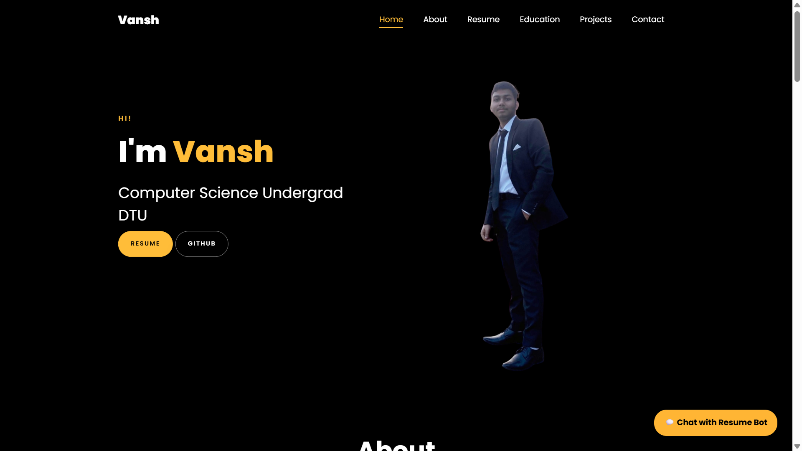

# 🌐 Personal Portfolio Website

## 🔗 Live Demo

👉 https://vanshkwalia-portfolio.netlify.app/

---

A modern and fully responsive personal portfolio website designed to showcase my skills, projects, and achievements. Built with smooth animations, clean UI, and interactive elements to provide a seamless user experience.

---

## 🚀 Features

* Responsive design for all screen sizes (desktop + mobile)
* Smooth scrolling navigation with section-based layout
* Animated UI elements using CSS and JavaScript
* Typing animation effect on homepage
* Dedicated sections:

  * Home
  * About
  * Skills
  * Projects
  * Education
  * Contact
* Interactive project showcase
* Clean and modern dark-themed interface

---

## 🛠️ Tech Stack

* HTML5
* CSS3 (Animations, Flexbox, Responsive Design)
* JavaScript (ES6+)
* Libraries:

  * AOS (Animation on Scroll)
  * Owl Carousel
  * Bootstrap Icons

---

## ⚡ Key Highlights

* Designed a visually appealing and user-friendly portfolio
* Implemented typing animation and scroll-based animations
* Structured layout for clear presentation of skills and projects
* Built reusable and modular UI components
* Optimized for performance and responsiveness

---

## 📸 Preview

---

## ▶️ How to Run

1. Clone the repository
2. Open `index.html` in your browser

---

## 🎯 Future Improvements

* Add backend for contact form handling
* Improve chatbot/AI interaction
* Add blog or achievements section
* Enhance animations and transitions

---

## 👨‍💻 Author

**Vansh**
DTU · CSE

---

⭐ If you found this project useful, give it a star!
